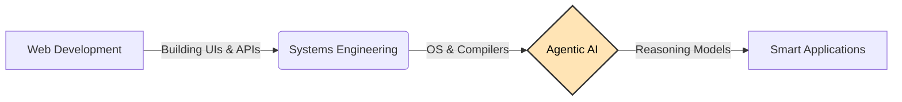

<h2 align="center">About me✨</h2>

# Hi, I'm Hafsa! (metachemist) 👋

I’m a Computer Science student and a visual learner who loves breaking down complex systems. 

I started out building standard web apps, but lately, I’ve been obsessed with **Agentic AI**—making software that doesn't just display data, but understands and acts on it. When I'm not coding, I'm usually lost in a fiction book or re-watching *Attack on Titan*.

---

### 🔭 What I'm working on
Right now, I'm building **[Physical AI Textbook](https://github.com/metachemist/specs-textbook-with-rag)**. 
It's an interactive learning platform that uses **RAG (Retrieval-Augmented Generation)** to let students chat directly with their textbooks. 

* **The Goal:** Move beyond static PDFs to books that can answer questions.
* **The Tech:** Next.js, FastAPI, Vector Databases (Qdrant), and LLMs.

---

### 🗺️ My Current Path
Since I understand things better with diagrams, here is a snapshot of where I am heading:

<h2 align="center"> My ToolBox </h2>

  <h4 align="left">Programming Languages:</h4>

 
   
  <a href="https://www.w3schools.com/css/" target="_blank" rel="noreferrer">   
   
   
   
   
    

<h4 align="left">Libraries and Frameworks:</h4>
   
    
    
    

<h4 align="left">Version Control:</h4>

   </a> 

<h2 align="center">GitHub Stats</h2>

 
  
   
   
  

<h3 align="center">Show some ❤️ by starring some repositories</h3>
